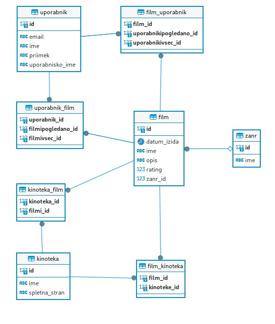

Filmi
- film_id (primarni ključ)
- film_ime
- rating
- datum_izida
- opis
- informacija o žanru (tuji ključ)
- kinoteke, kjer je film dostopen
- uporabniki, ki so gledali film 
- uporabniki, katerim je film bil všeč

Žanr
- zanr_id (primarni ključ)
- ime žanra
- filmi tega žanra

Kinoteka
- kinoteka_id (primarni ključ)
- kinoteka_ime
- spletna_stran
- dostopni filmi

Uporabnik
- uporabnik_id (primarni ključ)
- ime 
- priimek
- uporabnisko_ime
- email
- pogledani filmi
- filmi, ki so uporabniku bili všeč

Konceptualni model:

